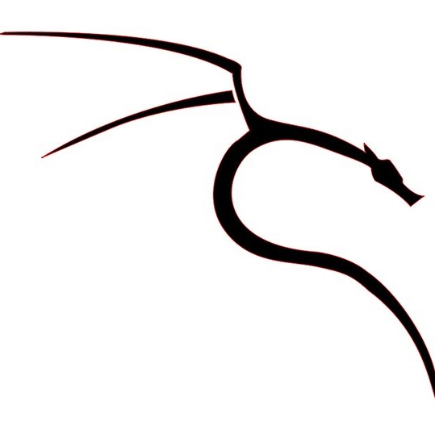

  

For this project, we were mainly tasked to read through a pre-prepared book teaching the basics of wireless communications and the various protocols associated with the security of these devices. This project gave us the nessecary tools and knowledge about these kinds of protocols to help further research into ways an attacker may use exploits and protect the devices against them.

For this project, me and my partner took turns recreating the various types of attacks from "Evil Twin" attacks, to "man-in-the-middle." At the end of the project we were to demonstrate what we learned by creating a bash script which would all or part of the proccess. I took to automating the packet injecting process. This process involves the use of the aircrack-ng suite that is preinstalled in Kali Linux. My script allowed for a continuous stream of packets to be captured by our WiFi card for the other proccess that needed them.
