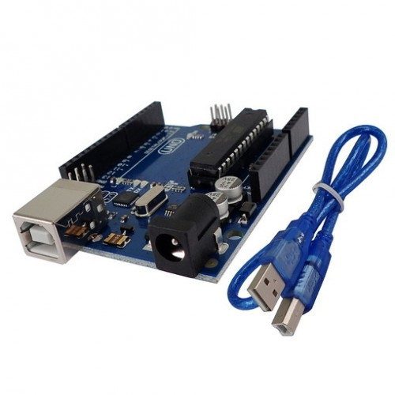

  

The purpose of this project is to famliarize ourselves with the Android Studio IDE. To prove this we are tasked with creating an android application by the end of the semester. My team decided to create a disaster preparedness app called Hawaii Emergency Preparedness App (HEPA). This app provides users with a checklist of various items essential for an emergency. The app calculates the quantity needed for a certain amount of people and for a given period of time. It also had a tsunami altitude detector. This feature would read your GPS signal and determine if you are at a high enough elavation to be safe against a tsunami.

For this project, I worked on programming the tsunami altitude detector. I first looked up the various android libraries regarding the GPS module. I then created a proto-function that displayed the GPS altitude reading on the screen. It is here that I discovered the need to poll the signal at a constant rate instead of continuously. The last implementation of the function was to turn the screen RED if the user was in a danger zone, YELLOW if the user was in a safe area in a low category tsunami, but a danger area for a high catagory one, and GREEN if the user was at a safe altitude.

